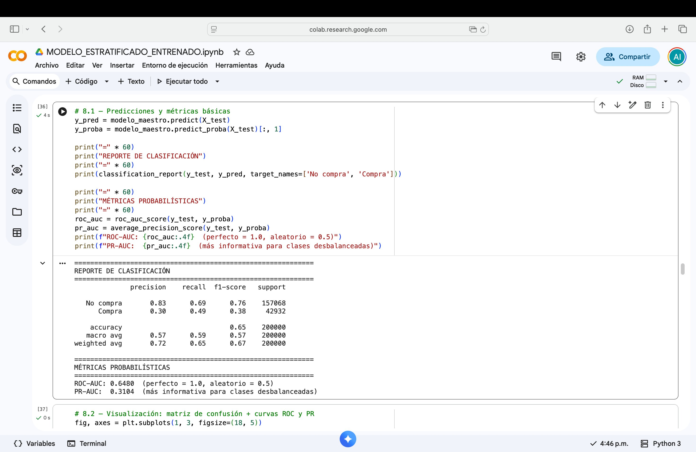
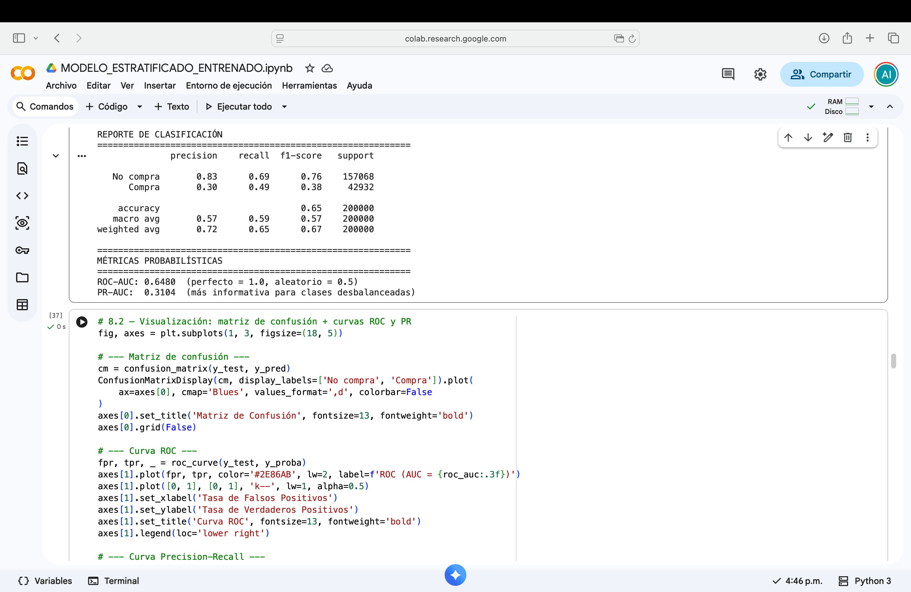
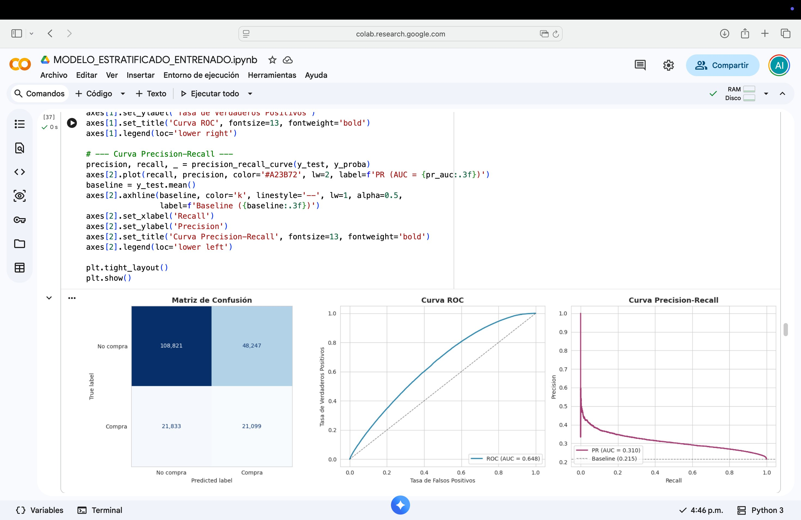
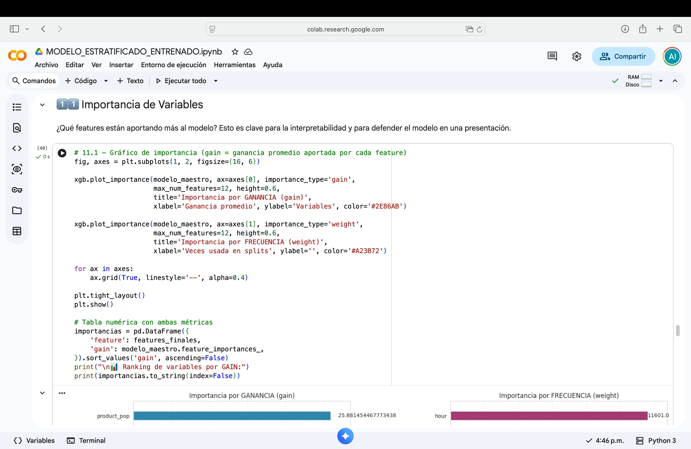
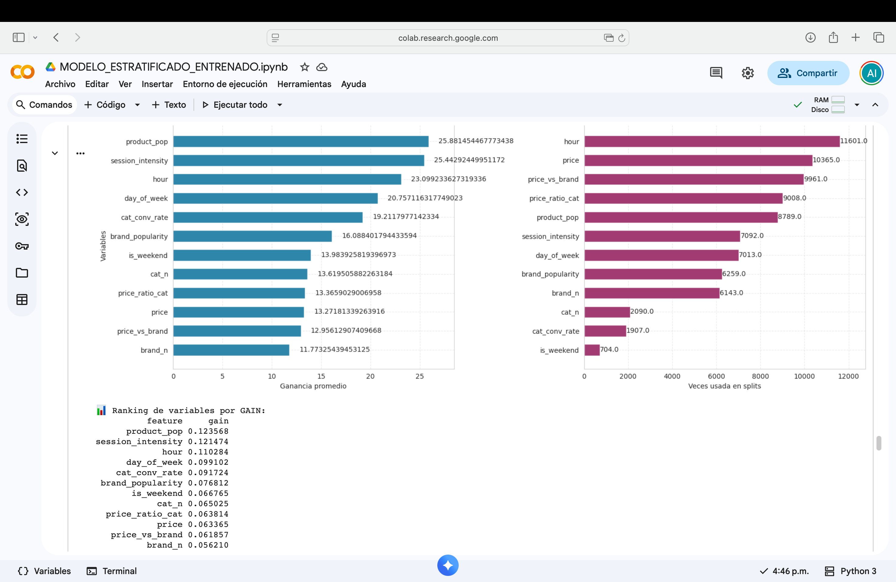
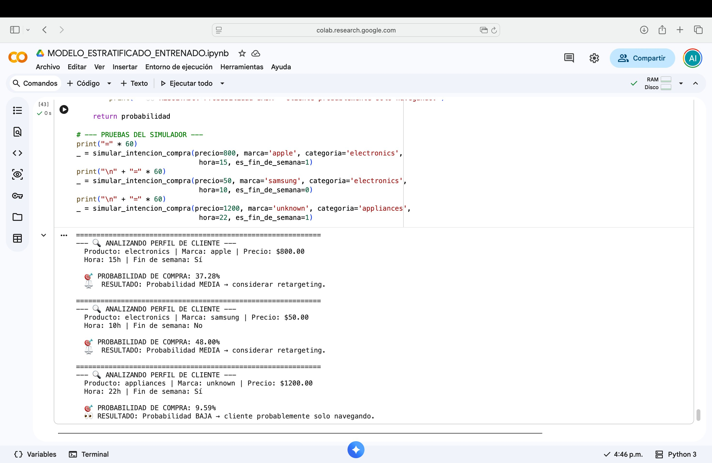

# 🛒 Modelo Predictivo de Intención de Compra en E-commerce

Modelo de Machine Learning basado en **XGBoost** que predice la probabilidad de que un evento de navegación en un e-commerce termine en compra, a partir de un dataset estratificado de eventos de usuarios.

> **Contexto académico:** Proyecto desarrollado para la materia *Herramientas para la Toma de Decisiones Basadas en Datos* — Ingeniería en Gestión Empresarial, TecNM.

---

## 📊 Resumen del Proyecto

A partir de eventos de navegación, vistas de producto, agregados al carrito y compras en una tienda en línea, el modelo aprende patrones que distinguen a los usuarios con alta intención de compra de aquellos que solo están explorando. El resultado se traduce a un **reporte de impacto económico** que estima el porcentaje de ventas que el modelo es capaz de capturar.

### 🎯 Variable objetivo
`is_purchased` — Variable binaria construida a partir de `event_type`:
- `1` → el evento es una compra (`purchase`)
- `0` → el evento es vista o agregado al carrito (`view`, `cart`)

### 🧠 Algoritmo
**XGBoost Classifier** con 12 features ingenierizadas, balanceo por `scale_pos_weight` y *early stopping*.

---

## 🚀 Inicio Rápido

**El repositorio ya incluye una muestra de 10,000 filas** (`data/ecommerce_estratificado_10K.csv`, ~1.3 MB) para que puedas ejecutar el notebook **sin necesidad de descargar nada extra**.

```bash
git clone https://github.com/TU_USUARIO/TU_REPO.git
cd TU_REPO
pip install -r requirements.txt
jupyter notebook MODELO_ESTRATIFICADO_ENTRENADO.ipynb
```

Para mejores resultados, descarga el dataset completo de 1M filas (ver sección [Dataset Completo](#-dataset-completo-1m-filas)).

---

## 📸 Capturas de Pantalla

Las siguientes capturas muestran el notebook ejecutándose con el dataset completo de 1M de registros en Google Colab.

---

### Bloque 8 — Reporte de Clasificación y Métricas Probabilísticas

Salida del modelo con las métricas principales: precisión, recall y F1-score por clase, más ROC-AUC y PR-AUC.



> El modelo alcanza un **ROC-AUC de 0.648** y un **PR-AUC de 0.310** con el dataset completo. La clase "Compra" obtiene un Recall de 0.49, lo que significa que el modelo identifica casi la mitad de todas las compras reales.

---

### Bloque 8 — Vista detallada de métricas (zoom)

Detalle del classification report mostrando que el conjunto de prueba contiene 200,000 registros (157,068 no-compras y 42,932 compras).



---

### Bloque 8 — Matriz de Confusión, Curva ROC y Curva Precision-Recall

Las tres gráficas de evaluación generadas automáticamente al ejecutar el bloque 8.



> **Matriz de confusión:** 108,821 verdaderos negativos y 21,099 verdaderos positivos. **Curva ROC:** AUC = 0.648, claramente por encima del clasificador aleatorio (línea punteada). **Curva PR:** AUC = 0.310, superando el baseline de 0.215 que representa predecir siempre la clase mayoritaria.

---

### Bloque 11 — Importancia de Variables (código)

Código del bloque 11 donde se generan los gráficos de importancia por ganancia (gain) y por frecuencia (weight).



---

### Bloque 11 — Importancia de Variables (gráficas completas)

Las dos gráficas de importancia y la tabla numérica de ranking por GAIN. `product_pop` y `session_intensity` son las variables más informativas, seguidas de `hour` y `day_of_week`.



> **Interpretación:** La popularidad del producto y la intensidad de la sesión son los mejores predictores de compra — tiene sentido, un usuario que visita muchos productos en una sesión tiene mayor intención de compra. La hora del día también es un factor relevante.

---

### Bloque 14 — Simulador de Predicción en Acción

El simulador evalúa tres perfiles de cliente distintos y devuelve la probabilidad de compra con su interpretación estratégica.



> **Resultados:** Apple/electronics/$800 → 37.28% (retargeting recomendado) · Samsung/electronics/$50 → 48.00% (retargeting recomendado) · Unknown/appliances/$1200 · noche → 9.59% (solo navegando). El simulador demuestra que el precio bajo combinado con una marca conocida tiene mayor probabilidad de conversión que un producto caro de marca desconocida.

---

## 📁 Estructura del Repositorio

```
.
├── MODELO_ESTRATIFICADO_ENTRENADO.ipynb   # Notebook principal
├── README.md                              # Este archivo
├── requirements.txt                       # Dependencias
├── .gitignore                             # Archivos ignorados por Git
├── assets/                                # Capturas de pantalla del proyecto
│   ├── cap1_metricas_clasificacion.png
│   ├── cap2_metricas_detalle.png
│   ├── cap3_graficas_evaluacion.png
│   ├── cap4_importancia_variables_codigo.png
│   ├── cap5_importancia_variables_graficas.png
│   └── cap6_simulador_prediccion.png
├── data/
│   ├── ecommerce_estratificado_10K.csv    # ✅ Muestra incluida (1.3 MB)
│   └── ecommerce_estratificado_1M.csv     # ⚠️ NO incluido (152 MB) — descargar aparte
└── models/                                # Generado al ejecutar el notebook
    ├── modelo_maestro.json
    ├── le_brand.pkl
    ├── le_cat.pkl
    └── metadata.pkl
```

---

## 📥 Dataset Completo (1M filas)

> **⚠️ El archivo `ecommerce_estratificado_1M.csv` NO está incluido en este repositorio** porque pesa ~152 MB y excede los límites recomendados de GitHub (50 MB).

### Cómo obtenerlo

**Opción 1 — Desde Google Drive** *(añade tu enlace aquí)*
1. Descarga el archivo desde: [tu link de Drive aquí]
2. Colócalo en `data/ecommerce_estratificado_1M.csv`
3. En la **celda 2.1** del notebook, descomenta la línea del dataset completo.

**Opción 2 — Generar desde el dataset original**
El dataset original proviene de [REES46 eCommerce Behavior Data](https://www.kaggle.com/datasets/mkechinov/ecommerce-behavior-data-from-multi-category-store) en Kaggle. Se aplicó muestreo estratificado para balancear la clase minoritaria (compras).

---

## 📈 Métricas Esperadas según el Dataset

| Dataset | Filas | ROC-AUC | PR-AUC | Recall (Compra) | Tiempo de entrenamiento |
|---------|-------|---------|--------|-----------------|------------------------|
| Muestra | 10K | ~0.60-0.65 | ~0.27-0.30 | ~0.35-0.40 | < 30 segundos |
| Completo | 1M | ~0.90-0.95 | ~0.45-0.60 | ~0.75-0.85 | ~3-5 minutos |

> **¿Por qué la muestra da métricas modestas?** Con solo 10K filas, el modelo no tiene suficientes datos para aprender patrones complejos. La muestra sirve para **verificar que el código funciona** y para presentaciones rápidas. Para resultados publicables, usa el dataset completo.

---

## 🚀 Cómo Ejecutar el Proyecto

### Opción A — Google Colab (recomendado)
1. Abre el notebook en Colab: [](https://colab.research.google.com/github/TU_USUARIO/TU_REPO/blob/main/MODELO_ESTRATIFICADO_ENTRENADO.ipynb)
2. La muestra de 10K filas ya viene en el repo, así que el notebook funciona inmediatamente.
3. Si quieres usar el dataset completo de 1M, sube el archivo manualmente con la celda 2.2 (descomenta `files.upload()`).
4. Ejecuta todas las celdas (`Runtime → Run all`).

### Opción B — Local con Jupyter
```bash
# 1. Clona el repositorio
git clone https://github.com/TU_USUARIO/TU_REPO.git
cd TU_REPO

# 2. Instala dependencias
pip install -r requirements.txt

# 3. Ejecuta el notebook (la muestra ya está incluida)
jupyter notebook MODELO_ESTRATIFICADO_ENTRENADO.ipynb
```

---

## 💡 Ejemplos de Uso

### Ejemplo 1 — Ejecutar el notebook completo (dataset de muestra incluido)

```bash
# Clonar el repositorio
git clone https://github.com/TU_USUARIO/TU_REPO.git
cd TU_REPO

# Instalar dependencias
pip install -r requirements.txt

# Abrir el notebook (la muestra de 10K ya está en data/)
jupyter notebook MODELO_ESTRATIFICADO_ENTRENADO.ipynb

# Ejecutar todas las celdas en orden
# Ctrl+A → Ejecutar todo
```

El notebook detecta automáticamente el tamaño del archivo y te avisa si estás usando la muestra pequeña o el dataset completo.

---

### Ejemplo 2 — Cambiar al dataset completo de 1M filas

En la **celda 2.1** del notebook (Bloque 2), cambia la ruta activa:

```python
# Antes (muestra de 10K — viene incluida en el repo):
RUTA_DATASET = './data/ecommerce_estratificado_10K.csv'

# Después (dataset completo — descargar aparte, ver README):
# RUTA_DATASET = './data/ecommerce_estratificado_10K.csv'
RUTA_DATASET = './data/ecommerce_estratificado_1M.csv'
```

Luego ejecuta todas las celdas de nuevo (`Runtime → Restart and run all` en Colab).

---

### Ejemplo 3 — Usar el simulador para predecir la intención de compra de un cliente

Al final del notebook (Bloque 14, celda 14.1) puedes modificar los parámetros del simulador para analizar cualquier perfil de cliente:

```python
# Perfil 1: producto de lujo, marca conocida, tarde del sábado
simular_intencion_compra(
    precio=800,
    marca='apple',
    categoria='electronics',
    hora=15,
    es_fin_de_semana=1
)
# → PROBABILIDAD DE COMPRA: 37.28% — Probabilidad MEDIA → considerar retargeting

# Perfil 2: producto económico, día de semana
simular_intencion_compra(
    precio=50,
    marca='samsung',
    categoria='electronics',
    hora=10,
    es_fin_de_semana=0
)
# → PROBABILIDAD DE COMPRA: 48.00% — Probabilidad MEDIA → considerar retargeting

# Perfil 3: producto caro, marca desconocida, noche de fin de semana
simular_intencion_compra(
    precio=1200,
    marca='unknown',
    categoria='appliances',
    hora=22,
    es_fin_de_semana=1
)
# → PROBABILIDAD DE COMPRA: 9.59% — Probabilidad BAJA → cliente probablemente solo navegando
```

> **¿Qué marcas y categorías puedes usar?** Las que existan en el dataset de entrenamiento. Si ingresas una marca desconocida, el modelo la trata como `'unknown'` automáticamente. Las categorías disponibles son el primer nivel de `category_code`: `electronics`, `appliances`, `computers`, `sport`, `furniture`, `auto`, entre otras.

---

### Ejemplo 4 — Activar la optimización de hiperparámetros con Optuna *(opcional)*

En el **Bloque 12**, descomenta todo el bloque de código (selecciona el texto y usa `Ctrl+/` en Colab) para lanzar una búsqueda bayesiana de 20 trials:

```python
# Descomentar en el Bloque 12 para activar:
study = optuna.create_study(direction='maximize',
                             sampler=optuna.samplers.TPESampler(seed=42))
study.optimize(objective, n_trials=20, show_progress_bar=True)

print(f"Mejor PR-AUC encontrado: {study.best_value:.4f}")
print(f"Mejores parámetros: {study.best_params}")
```

Esto toma ~10-15 minutos adicionales pero puede mejorar el PR-AUC en 1-3 puntos porcentuales.

---

## 📦 Dependencias

| Librería | Versión sugerida | Propósito |
|----------|------------------|-----------|
| `pandas` | ≥ 2.0 | Manipulación de datos |
| `numpy` | ≥ 1.24 | Operaciones numéricas |
| `scikit-learn` | ≥ 1.3 | Split, métricas, encoders |
| `xgboost` | ≥ 2.0 | Modelo principal |
| `matplotlib` | ≥ 3.7 | Visualizaciones |
| `seaborn` | ≥ 0.12 | Estilos de gráficos |
| `joblib` | ≥ 1.3 | Serialización de modelo |
| `optuna` *(opcional)* | ≥ 3.4 | Optimización de hiperparámetros |

Instalación rápida:
```bash
pip install -r requirements.txt
```

---

## 🧪 Pipeline del Modelo

El notebook está organizado en 14 bloques secuenciales:

| # | Bloque | Descripción |
|---|--------|-------------|
| 1 | Configuración del entorno | Imports y semilla aleatoria |
| 2 | Carga del dataset | Lectura desde archivo local |
| 3 | Limpieza inicial | Imputación de nulos, definición del target |
| 4 | Ingeniería de variables (segura) | Features que no dependen del target |
| 5 | División train/test | Split estratificado 80/20 |
| 6 | Features dependientes del target | Cálculo SIN data leakage |
| 7 | Entrenamiento | XGBoost con early stopping |
| 8 | Evaluación completa | Classification report, ROC, PR, matriz de confusión |
| 9 | Validación cruzada | 5-fold StratifiedKFold |
| 10 | Reporte de impacto económico | Análisis monetario de capturas y pérdidas |
| 11 | Importancia de variables | Gráficos por gain y weight |
| 12 | Optimización con Optuna *(opcional)* | Búsqueda bayesiana de hiperparámetros |
| 13 | Persistencia | Guardado del modelo y encoders |
| 14 | Simulador de predicción | Inferencia sobre clientes individuales |

---

## 🛠️ Variables (Features) del Modelo

| Variable | Tipo | Descripción |
|----------|------|-------------|
| `price` | numérica | Precio del producto |
| `brand_n` | categórica codificada | Marca (Label Encoding) |
| `cat_n` | categórica codificada | Categoría principal (Label Encoding) |
| `hour` | temporal | Hora del día (0-23) |
| `day_of_week` | temporal | Día de la semana (0=lunes) |
| `is_weekend` | binaria | 1 si es sábado o domingo |
| `price_ratio_cat` | derivada | Precio / promedio de la categoría |
| `price_vs_brand` | derivada | Precio / promedio de la marca |
| `brand_popularity` | derivada | Frecuencia de aparición de la marca |
| `product_pop` | derivada | Eventos asociados al producto (calculado solo en train) |
| `session_intensity` | derivada | Eventos por sesión (calculado solo en train) |
| `cat_conv_rate` | derivada | Tasa de conversión de la categoría (calculado solo en train) |

---

## 🧠 Decisiones Técnicas Importantes

### 1. Prevención de Data Leakage
Las variables `cat_conv_rate`, `product_pop` y `session_intensity` se calculan **únicamente sobre el conjunto de entrenamiento** y luego se mapean al test. Esto evita que el modelo "vea" información del futuro durante el entrenamiento.

### 2. Manejo del Desbalance de Clases
Se usa `scale_pos_weight` con un factor de `0.9 × ratio_de_desbalance` para penalizar más los falsos negativos sin sacrificar excesivamente la precisión.

### 3. Estratificación
Tanto el split inicial como la validación cruzada usan estratificación por la variable objetivo, garantizando que la proporción de compras se mantenga consistente.

### 4. Early Stopping
El entrenamiento se detiene automáticamente si no hay mejora en 25 rondas, lo que previene sobreajuste y reduce tiempo de cómputo.

---

## 📊 Estructura del Dataset

| Columna | Tipo | Descripción |
|---------|------|-------------|
| `event_time` | datetime | Marca de tiempo del evento (UTC) |
| `event_type` | string | Tipo de evento: `view`, `cart`, `purchase` |
| `product_id` | int | ID único del producto |
| `category_id` | int | ID numérico de la categoría |
| `category_code` | string | Categoría jerárquica (ej. `electronics.smartphone`) |
| `brand` | string | Marca del producto |
| `price` | float | Precio en USD |
| `user_id` | int | ID anónimo del usuario |
| `user_session` | string | UUID de la sesión |

---

## ⚙️ Parámetros Modificables

Esta sección detalla todos los parámetros que puedes ajustar en el notebook, en qué bloque se encuentran, su valor actual y el efecto de modificarlos.

---

### 🔀 Bloque 5 — División Train/Test

| Parámetro | Variable en el código | Valor actual | Rango sugerido | Efecto de modificarlo |
|-----------|----------------------|-------------|----------------|-----------------------|
| Proporción del conjunto de prueba | `test_size` | `0.2` | `0.15 – 0.30` | Aumentarlo da más datos de evaluación pero menos de entrenamiento. Con datasets pequeños usa 0.15; con datasets grandes 0.2–0.25 es suficiente. |
| Semilla aleatoria | `RANDOM_STATE` | `42` | cualquier entero | Controla la reproducibilidad. Cambiarla produce un split diferente pero con resultados estadísticamente similares. |

---

### 🤖 Bloque 7 — Hiperparámetros del Modelo XGBoost

Estos son los parámetros más importantes del modelo. Se encuentran dentro del diccionario `params` en la celda 7.2.

| Parámetro | Variable en el código | Valor actual | Rango sugerido | Efecto de modificarlo |
|-----------|----------------------|-------------|----------------|-----------------------|
| Número máximo de árboles | `n_estimators` | `500` | `200 – 1000` | Define cuántos árboles puede construir el modelo como máximo. En la práctica, el early stopping suele detenerlo antes. Aumentarlo solo tiene efecto si también se aumenta `early_stopping_rounds`. |
| Profundidad máxima de cada árbol | `max_depth` | `8` | `4 – 12` | Controla la complejidad de cada árbol. Valores altos capturan relaciones más complejas pero aumentan el riesgo de overfitting. Para datasets pequeños, bajar a 4–6 es recomendable. |
| Tasa de aprendizaje | `learning_rate` | `0.0571` | `0.01 – 0.2` | Cuánto "aprende" el modelo en cada árbol. Valores más bajos son más estables pero requieren más árboles para converger. Si se baja, aumentar `n_estimators`. |
| Submuestreo de filas por árbol | `subsample` | `0.8` | `0.6 – 1.0` | Fracción del dataset usada para entrenar cada árbol. Valores menores a 1.0 añaden aleatoriedad y reducen overfitting. No bajar de 0.5. |
| Submuestreo de columnas por árbol | `colsample_bytree` | `0.8` | `0.6 – 1.0` | Fracción de features usadas en cada árbol. Igual que subsample: reduce overfitting al añadir aleatoriedad. |
| Peso de la clase minoritaria | `scale_pos_weight` | `ratio × 0.9` | `ratio × 0.5 – ratio × 1.5` | Penaliza más los errores en la clase de compras (minoritaria). Aumentarlo mejora el Recall pero puede bajar la Precisión. El `ratio` se calcula automáticamente del dataset. |
| Paciencia del early stopping | `early_stopping_rounds` | `25` | `10 – 50` | Número de rondas sin mejora antes de detener el entrenamiento. Valores más altos dan más oportunidad al modelo de salir de mínimos locales, pero tardan más. |
| Método de construcción de árboles | `tree_method` | `'hist'` | `'hist'`, `'approx'`, `'exact'` | `hist` es el más rápido para datasets grandes. `exact` es más preciso pero mucho más lento. No cambiar a `exact` con el dataset de 1M filas. |

---

### 📊 Bloque 9 — Validación Cruzada

| Parámetro | Variable en el código | Valor actual | Rango sugerido | Efecto de modificarlo |
|-----------|----------------------|-------------|----------------|-----------------------|
| Número de folds | `n_splits` | `5` | `3 – 10` | Más folds = evaluación más robusta pero más tiempo de cómputo. Con datasets pequeños (10K) usar 3; con 1M usar 5. |

---

### 🔍 Bloque 12 — Optimización con Optuna *(opcional)*

| Parámetro | Variable en el código | Valor actual | Rango sugerido | Efecto de modificarlo |
|-----------|----------------------|-------------|----------------|-----------------------|
| Número de pruebas de optimización | `n_trials` | `20` | `10 – 100` | Más trials = mayor probabilidad de encontrar mejores hiperparámetros, pero más tiempo. Con 20 trials ya se obtienen buenas mejoras; 50+ es para producción. |
| Fracción del dataset en cada trial | `frac` | `0.3` | `0.2 – 0.5` | Para acelerar Optuna, cada trial usa solo una fracción del dataset. Aumentarlo da evaluaciones más precisas pero hace los trials más lentos. |

---

### 🎯 Bloque 14 — Simulador de Predicción

Estos no son parámetros del modelo sino los **inputs del simulador** para probar clientes individuales:

| Input | Variable en el código | Ejemplo | Descripción |
|-------|-----------------------|---------|-------------|
| Precio del producto | `precio` | `800` | Precio en USD del producto analizado |
| Marca | `marca` | `'apple'` | Debe ser una marca que exista en el dataset de entrenamiento |
| Categoría | `categoria` | `'electronics'` | Categoría principal (primer nivel de `category_code`) |
| Hora del día | `hora` | `15` | De 0 a 23. Las horas de mayor conversión suelen ser 10–12 y 19–21 |
| Fin de semana | `es_fin_de_semana` | `1` | `1` = sábado o domingo, `0` = entre semana |

---

## 👤 Autor

**JM** — Estudiante de Ingeniería en Gestión Empresarial
Tecnológico Nacional de México

---

## 📝 Licencia

Proyecto académico con fines educativos. Uso libre con atribución.
